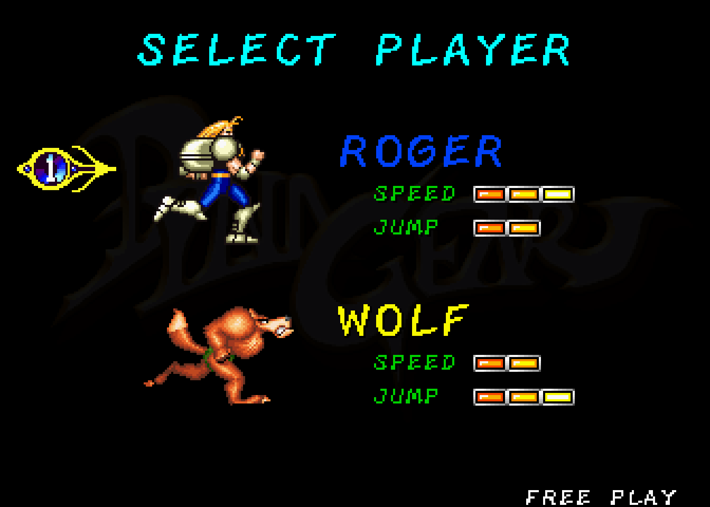
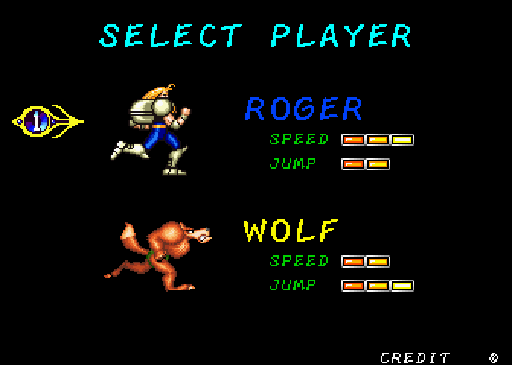
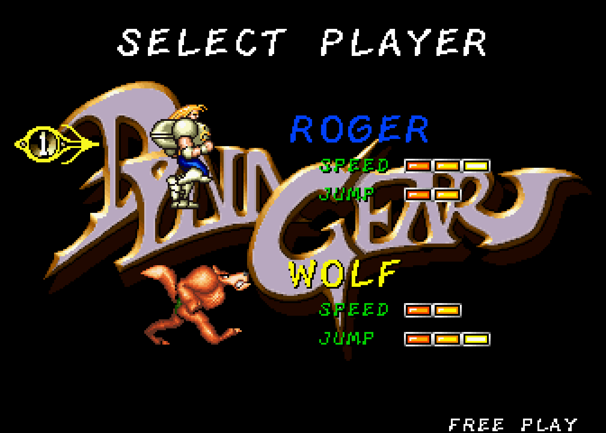
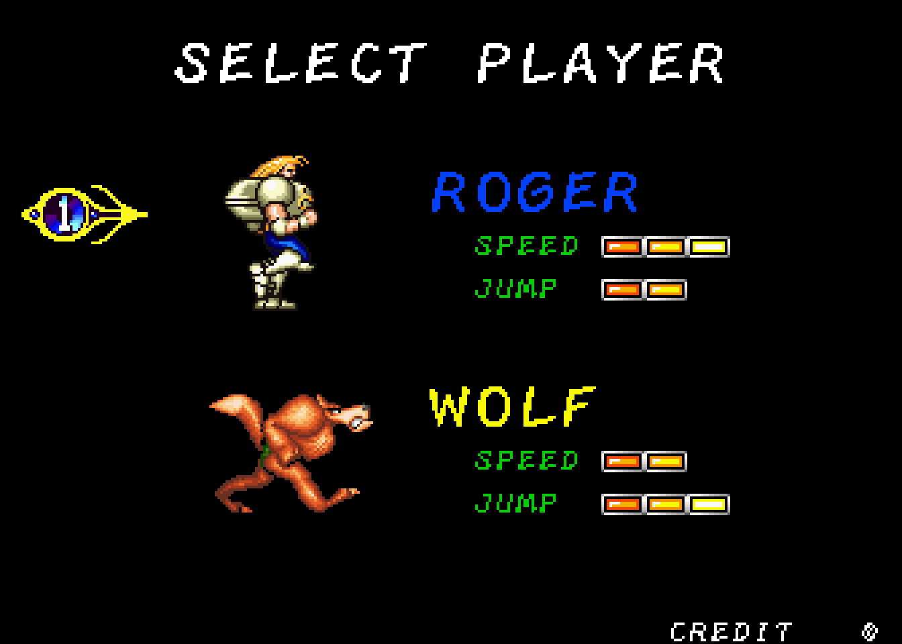
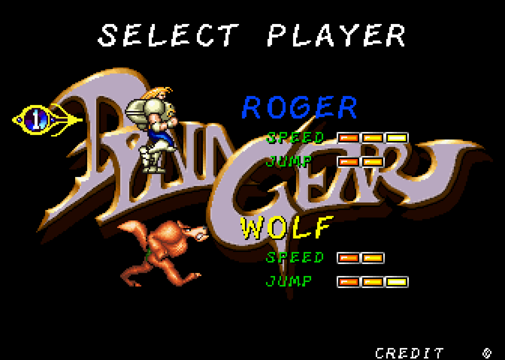

# Dyna Gear — is the tilemap page fix correct? MAME evidence for frames 176+

Subject: commit `fd37ce6` "Fix tilemap page selection so a scrolling layer stays
in its own map" (`rtl/video/ssv_cached_sprite_renderer.sv`,
`rtl/video/ssv_bg_renderer.sv`).

The fix changes 236 frames of the 950-frame golden
`sim_output/diff/rtl_final96_gameplay_frames.crc`, first divergence at post-VE
frame 176. That golden is an RTL-vs-RTL regression baseline, **not** a
correctness oracle — only attract frames 2–3 were ever pixel-matched to MAME —
so it cannot decide whether the change is an improvement. This document answers
the only question that can: **is the new rendering at frames 176+ closer to MAME
than the old one?**

Produced on `work/v60-opcode-audit` at `ec187f8` (merge of `origin/main`
containing `fd37ce6`). Verilator 5.032, MAME 0.285, WSL.

---

## Verdict

**Yes — decisively, at every frame that could be tested.**

Fourteen frames inside the changed range were sampled. At **8** of them the new
renderer is **pixel-identical to MAME** — zero differing pixels outside two
small regions that differ for reasons unrelated to this fix. At the other 6 it
is still substantially closer to MAME than the old renderer. **At none is it
worse.** Two further frames outside the changed range were sampled as controls
and both builds are pixel-identical to MAME there.

Across the whole `176..369` run the old renderer is wrong by roughly **15,000
pixels per frame**, because it drops the entire `DYNA GEAR` logo background
layer from the character-select screen. The failure is not subtle — on the old
renderer that layer is simply absent:

| MAME (frame 175) | old RTL (frame 176) | new RTL (frame 176) |
|---|---|---|
|  |  |  |

| MAME (frame 299) | old RTL (frame 300) | new RTL (frame 300) |
|---|---|---|
|  |  |  |

### Recommendation

**Re-baseline `sim_output/diff/rtl_final96_gameplay_frames.crc`**, in its own
commit, citing this document. The current baseline encodes a missing background
layer across frames 176–421 and preserving it protects nothing.

I have deliberately **not** re-baselined it here.

### What this does not settle

One residual, *pre-existing* defect is visible in the same era and is **not**
introduced by this fix — the fix halves it. See § *Residual: faint background
missing in the space cutscene*. It is a separate follow-up, not a reason to
withhold the re-baseline.

---

## What was built and compared

| Build | Renderers | Everything else |
|---|---|---|
| `new` | `rtl/video/*` at HEAD (`ec187f8`, contains `fd37ce6`) | HEAD |
| `old` | `ssv_bg_renderer.sv` + `ssv_cached_sprite_renderer.sv` from `fd37ce6^` | HEAD |

`old` is a scratch A/B build only. **`rtl/` on the branch was not modified.** The
pre-fix sources were extracted with `git show fd37ce6^:…` into the gitignored
`sim_output/ab/oldrtl/` and handed to Verilator in place of the tracked files
(`tools/ab-build-variant.sh`). The only textual difference between the two
source sets is the fix itself — 17 lines in `ssv_bg_renderer.sv`, 27 in
`ssv_cached_sprite_renderer.sv`, ignoring CRLF.

Scenario `coin_start_p1_gameplay`, 950 post-VE frames, deterministic
(`+verilator+seed+1 +verilator+rand+reset+2`), assertions on, default fast SDRAM
model. Both builds finished `overruns bg=0 obj=0 max_line_entries=86`.

### Control 1 — the `old` build reproduces the golden exactly

```
$ diff sim_output/diff/rtl_final96_gameplay_frames.crc sim_output/ab/old950.crc
(no output — byte-identical, all 950 frames)
```

This is what makes the A/B meaningful. The pre-fix build is not merely *similar*
to the baseline, it **is** the baseline, so every difference measured below is
attributable to the fix and to nothing else.

### Control 2 — where the `new` build differs

236 frames differ, in two contiguous runs:

```
176..369  (194 frames)
380..421  ( 42 frames)
```

Frames 0–175, 370–379 and **422–949 are byte-identical** between the two builds.
The entire effect of this fix on this scenario is confined to the character
select / stage-intro era; the jungle gameplay frames the gate was built around
are untouched. Non-black pixels over the 950 frames rise from 34,414,974 (old)
to 37,310,177 (new) — 2.9 M pixels of content the old build was dropping.

---

## The MAME oracle

MAME 0.285 (`/usr/games/mame`), `dynagear`, driven by
`tools/mame-scenario-long.lua`, whose input schedule is identical to
`coin_start_p1_gameplay` for every frame below 950. Verified, not assumed: the
two scenario JSON schedules are equal element-for-element below frame 950, and
`apply_inputs()` in `verif/tb_ssv_frame_crc.sv` treats `coin_start_p1_long` and
`coin_start_p1_gameplay` identically there.

> `verif/scenarios/dynagear/coin_start_p1_gameplay.json` declares
> `"mame": "0.288"`. Only 0.285 is installed in this environment, so the
> comparison is against 0.285.

### Frame alignment: MAME index = RTL post-VE frame − 1

The Lua driver's frame counter runs one ahead of the testbench's
`post_ve_frames`. Measured on the logo fade-in, a sharp one-frame event
(differing pixels out of 80,640, unmasked):

| RTL frame | vs MAME 174 | vs MAME 175 | vs MAME 176 |
|---|---:|---:|---:|
| 174 | 1896 | 17479 | 18787 |
| 175 | **957** | 15228 | 16536 |
| 176 | 16064 | **121** | 1429 |

The alignment is unambiguous. It also accounts for part of what
`docs/issues/DYNAGEAR_MAME_VERILATOR_GAMEPLAY.md` recorded as an early
MAME/RTL split: some of that was an off-by-one in the comparison rather than a
core difference.

### Are the two runs in the same game state? Not always — checked, not assumed

This is the trap the previous long-scenario work fell into (MAME and RTL score
and lives had drifted apart by frame 1100, so late-frame pixel comparison meant
nothing). It was checked explicitly here rather than hoped for.

* **Before the character-select screen they are *not* comparable.** MAME's
  default DIPs put it in `FREE PLAY` while the scenario sets `dsw2=0xFFFD`, so
  the two run different attract sequences. At RTL frame 100 / MAME 99 the RTL
  shows `PUSH START / PUSH 1 OR 2 PLAYER BUTTON` and MAME shows the Sammy logo —
  ~13,000 px apart, **identically in both builds**. No frame below 171 is used
  as evidence.
* **On the character-select screen they are in lockstep.** Both enter it from
  the same P1 START press at frame 165, and from RTL frame 171 onward the *new*
  build is pixel-identical to MAME outside the masks — including at RTL 172 and
  174, which are *before* the first frame this fix changes. Two independently
  running emulations do not agree to zero pixels by accident; that agreement is
  the proof of comparable state, and it is what makes frames 176–360 admissible.
* **They part again at the screen transition** around RTL 370–379 (a ~2-frame
  offset, see the residuals below) and re-converge: RTL 430 is again pixel-exact.
* **Past ~450 they diverge irrecoverably**, as before. That costs nothing here,
  because frames 422–949 are byte-identical between the two builds — there is
  nothing to adjudicate.

### Masked regions

Two areas differ for reasons unrelated to this fix and are excluded from every
number in the verdict table (2,112 px total, 2.6 % of the frame):

| Region | Pixels | Why |
|---|---:|---|
| x 240–335, y 228–239 | 121 | `FREE PLAY` (MAME default DIPs) vs `CREDIT ⓪` (the scenario sets `dsw2=0xFFFD`). Constant from frame 30 on, identical in `old` and `new`. |
| x 8–47, y 68–91 | ≤233 | Credit indicator — same DIP cause, and the only region where two otherwise-identical MAME runs disagree (below). |

The masks are justified by a **control measurement**, not by assertion: at RTL
frames 172 and 174 — on the character-select screen but *before* the first
divergent frame — both `old` and `new` are pixel-identical to MAME, 0 differing
pixels outside the masks. If the masks were hiding a real difference, or the −1
offset were wrong, those frames could not come out clean. The same is true at
RTL frame 430, immediately after the changed range ends.

### ⚠ MAME's output depends on which frames you capture

This is a trap in the existing capture harness and it silently corrupts naive
comparisons. Recording it because it cost real time.

Two MAME runs — same binary, same arguments, fresh empty `-nvram_directory`
each, differing **only** in the `SSV_PPM_FRAMES` list — produce different
pixels:

| MAME frame | light run (6 captures) vs heavy run (69 captures) |
|---|---:|
| 175 | 233 px (credit indicator only) |
| 250 | 233 px (credit indicator only) |
| 300 | 22,117 px |
| 349 | 28,104 px |
| 450 | 45,420 px |

The same list run twice is byte-identical, so this is not ordinary
nondeterminism. Two causes were hypothesised with refutation conditions stated
first, and both were **refuted**:

* *Frameskip drift* — the Lua counter is a `register_frame_done` tally, so if
  video updates were skipped under I/O load the counter would fall behind
  emulated frames and shift the input schedule. **Refutation condition:** if
  `screen:frame_number() − base` equals the Lua counter in both a light and a
  heavy run, the hypothesis is dead. Instrumented in `sim_output/ab/probe.lua`;
  the delta is a constant `1` at every captured frame in **both** runs.
  Refuted.
* *NVRAM carry-over between runs.* **Refutation condition:** a fresh
  `-nvram_directory` per run removes the difference. It does not — and MAME
  writes no NVRAM files for this set at all. Refuted.

The remaining plausible mechanism, **untested here**, is that Lua
`screen:pixel()` forces a partial screen update and perturbs input-poll timing
relative to the CPU by enough to flip whether a button press lands on frame *N*
or *N+1*; one flipped press on the character-select screen then yields a
different playthrough. Consistent with the divergence appearing only after input
frames, but not proven.

**Mitigation used throughout.** Every MAME frame used as an oracle is
corroborated by at least two runs with *different* capture lists, one of which
captures that frame and nothing else (minimum perturbation). Frames where the
runs disagree are reported as inadmissible rather than averaged away.

---

## Results

Differing pixels out of 80,640, masked regions excluded. Reproduce with
`python3 tools/ab-compare-mame.py <frames>`.

| RTL frame | MAME frame | old ≠ MAME | new ≠ MAME | old ≠ new | verdict |
|---:|---:|---:|---:|---:|---|
| 172 | 171 | **0** | **0** | 0 | control, before the change |
| 174 | 173 | **0** | **0** | 0 | control, before the change |
| 176 | 175 | 15,006 | **0** | 15,006 | **new exact, old drops the logo** |
| 185 | 184 | 15,881 | 836 | 15,045 | new closer by 15,045 |
| 200 | 199 | 15,015 | **0** | 15,015 | **new exact** |
| 250 | 249 | 15,199 | **0** | 15,199 | **new exact** |
| 300 | 299 | 15,147 | **0** | 15,147 | **new exact** |
| 310 | 309 | 15,264 | **0** | 15,264 | **new exact** |
| 330 | 329 | 14,993 | **0** | 14,993 | **new exact** |
| 350 | 349 | 15,058 | **0** | 15,058 | **new exact** |
| 360 | 359 | 15,238 | **0** | 15,238 | **new exact** |
| 370 | 369 | 15,199 | 15,199 | 0 | fix inactive; both differ — see below |
| 380 | 379 | 2,521 | 1,295 | 1,268 | new closer by 1,226 |
| 390 | 389 | 2,515 | 1,305 | 1,241 | new closer by 1,210 |
| 400 | 399 | 2,484 | 1,299 | 1,209 | new closer by 1,185 |
| 410 | 409 | 2,437 | 1,294 | 1,184 | new closer by 1,143 |
| 420 | 419 | 2,411 | 1,291 | 1,153 | new closer by 1,120 |
| 430 | 429 | **0** | **0** | 0 | control, after the change |

**Every row above is the result from two independent MAME runs with different
capture lists** — `single` (one capture per run, minimum perturbation) and
`runP` (all 18 frames in one run). The two agree byte-for-byte at every frame
except MAME 249, where they differ only by the 233-px credit indicator that is
already masked; the numbers in the table are therefore identical from both
references, not averaged.

A third run `runQ` (the same 18 frames plus decoy captures at 60, 120, 150,
220, 270, 320, 340) agrees at frames 176–300 and then diverges in *game state*
— the capture perturbation described above. Its numbers at 310, 330 and 350
were discarded as inadmissible rather than reported. This is what the two-run
rule is for.

**Not one sampled frame favours the old renderer.**

### Two residuals, both explained

* **Frame 185, 836 px.** A single colour substitution — `00ffff` → `ffff00`
  across rows 16–29, i.e. the `SELECT PLAYER` title. That is a palette-cycle
  phase one step out, not a rendering error; it alternates every frame and is
  present identically in `old` (as part of its 15,881) and in the pre-divergence
  control frames.
* **Frame 370, 15,199 px in *both* builds.** The character-select screen ends
  here and the RTL blanks the logo about two frames before MAME does. Best
  alignment for RTL 370 is MAME **371** (2,930 px) rather than 369 (15,421 px),
  i.e. a ~2-frame transition offset. `old` and `new` are byte-identical at
  370–379, so this is untouched by the fix and pre-existing.

### Residual: faint background missing in the space cutscene

At frames 380–421 (the second changed run) neither build matches MAME. The new
build is consistently about **half as wrong** as the old — ~1,300 px versus
~2,500 px — so the fix is a clear improvement here too, but a residual remains.

Every one of the ~1,300 differences is one-directional and of the same shape:

```
COLOR_SUB count=145 ref=010107 got=000000
COLOR_SUB count=139 ref=0a0e11 got=000000
COLOR_SUB count=100 ref=080c0b got=000000
...
```

MAME draws a very dark, near-black pixel; the RTL draws pure black. The
differences are scattered across the whole play area (bbox (8,48)–(327,191),
≤21 px per row), not banded, so this is not the page-crossing signature. It
looks like a faint background layer that the RTL renders only partially. It is
**pre-existing** — the old build has the same defect, worse — and needs its own
investigation.

---

## Reproduction

All commands from the repo root inside WSL. Scratch artefacts land in the
gitignored `sim_output/ab/`.

```bash
# Build both variants (old = fd37ce6^ renderers, new = HEAD).  rtl/ is untouched.
mkdir -p sim_output/ab/oldrtl
git show fd37ce6^:rtl/video/ssv_bg_renderer.sv            > sim_output/ab/oldrtl/ssv_bg_renderer.sv
git show fd37ce6^:rtl/video/ssv_cached_sprite_renderer.sv > sim_output/ab/oldrtl/ssv_cached_sprite_renderer.sv
tools/ab-build-variant.sh new /tmp/ab/new
tools/ab-build-variant.sh old /tmp/ab/old

# 950-frame CRC + PPM captures for both (ulimit is required or it segfaults)
ulimit -s unlimited
tools/ab-run-captures.sh

FRAMES="171 173 175 184 199 249 299 309 329 349 359 369 379 389 399 409 419 429"

# MAME reference A: one frame per run (minimum perturbation)
for f in $FRAMES; do
  rm -rf /tmp/nv_s; mkdir -p /tmp/nv_s
  SSV_PPM_PREFIX=$PWD/sim_output/ab/single/m SSV_PPM_FRAMES="$f" SSV_MAX_FRAMES=$((f+5)) \
  /usr/games/mame dynagear -rompath sim_output/mame/roms -nvram_directory /tmp/nv_s \
    -video none -sound none -nothrottle -autoboot_script tools/mame-scenario-long.lua
done

# MAME reference B: all of them in one run, to corroborate A
rm -rf /tmp/nv_P; mkdir -p /tmp/nv_P sim_output/ab/runP
SSV_PPM_PREFIX=$PWD/sim_output/ab/runP/m SSV_MAX_FRAMES=440 \
SSV_PPM_FRAMES="$(echo $FRAMES | tr ' ' ',')" \
/usr/games/mame dynagear -rompath sim_output/mame/roms -nvram_directory /tmp/nv_P \
  -video none -sound none -nothrottle -autoboot_script tools/mame-scenario-long.lua

# Verdict table (reads sim_output/ab/{ppm,single,runP,runQ})
python3 tools/ab-compare-mame.py 172 174 176 185 200 250 300 310 330 350 \
                                 360 370 380 390 400 410 420 430
```

`tools/ab-build-variant.sh`, `tools/ab-run-captures.sh` and
`tools/ab-compare-mame.py` were written for this investigation and are committed
alongside this document so the method survives. A rebuild through the committed
script reproduces the frame CRCs of the ad-hoc build used above byte-for-byte
(200-frame check). The RTL frames used above come
from several capture passes with different `+DUMP_PPM_START/STEP/COUNT`
settings; `ab-compare-mame.py` searches every `*_f<N>.ppm` stem it knows about.
The frameskip probe (`sim_output/ab/probe.lua`) is a one-off instrumented copy
of `tools/mame-scenario-long.lua` that additionally prints
`screen:frame_number()`.

## Follow-ups this raises

1. **Fix the MAME capture harness.** `tools/mame-scenario-long.lua` produces
   results that depend on the capture list. Until that is understood, any MAME
   comparison must corroborate each frame across two runs with different lists.
2. **The ~1,300 missing faint background pixels** at frames 380–421 (space
   cutscene). Pre-existing, halved by this fix, not diagnosed.
3. **The ~2-frame character-select exit offset** at frames 370–379.
   Pre-existing, unaffected by this fix.
4. `docs/issues/DYNAGEAR_MAME_VERILATOR_GAMEPLAY.md` says the first post-coin
   MAME split is at frame 36. With the −1 offset applied, RTL and MAME are
   pixel-identical across the whole character-select screen. That document
   understates how far the agreement actually reaches and should be revisited.
